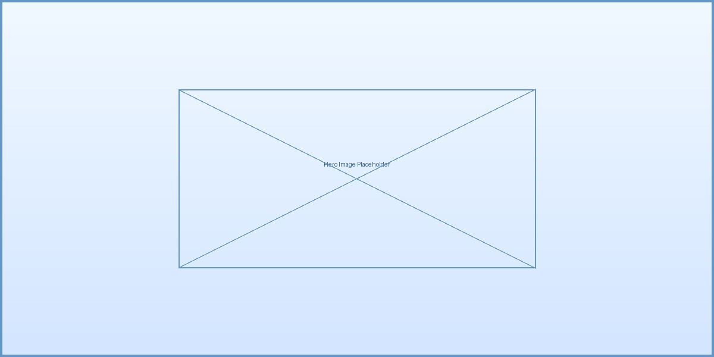

<section class="hero card glassy">
  

    <h1>Geoffrey Manda</h1>
    <h2>Data Science & AI Research</h2>
    
Advancing healthcare analytics through statistical innovation

    

      <a href="#featured-work" class="btn-primary hero-button primary">Explore My Work</a>
      <a href="contact" class="btn-secondary hero-button secondary">Get in Touch</a>
    

  

  

    <!-- Placeholder for hero image -->
    
  

</section>

<section id="featured-work" class="featured-section card glassy">
  <h2>Featured Work</h2>
  

    <!-- Feature Card 1 -->
    

      

        
      

      <h3>AI in Climate Modeling</h3>
      
Leveraging deep learning to improve climate prediction accuracy

      <a href="ai-projects#climate-modeling" class="feature-link btn-secondary">View Project →</a>
    

    <!-- Feature Card 2 -->
    

      

        
      

      <h3>Survival Analysis</h3>
      
Statistical models for time-to-event data in healthcare outcomes

      <a href="biostatistics#survival-analysis" class="feature-link btn-secondary">View Project →</a>
    

    <!-- Feature Card 3 -->
    

      

        
      

      <h3>Epidemiology Research</h3>
      
Disease pattern analysis and population health metrics

      <a href="epidemiology" class="feature-link btn-secondary">View Project →</a>
    

  

</section>

<section class="expertise-section card glassy">
  <h2>Areas of Expertise</h2>
  

    

      

        
      

      <h3>Artificial Intelligence</h3>
      
Machine learning applications in healthcare and climate science, policy development for responsible AI

    

    

      

        
      

      <h3>Biostatistics</h3>
      
Survival analysis, time-series modeling, and mixed-effects approaches for clinical research

    

    

      

        
      

      <h3>Epidemiology</h3>
      
Research design, causal inference, and statistical methods for population health studies

    

  

</section>



<section class="featured-section card glassy">
  <h2>Recent Updates</h2>
  

    

      

        
      

      
April 2023

      

        <h3>AI Climate Modeling Paper Published</h3>
        
New research on neural network applications in climate prediction

        <a href="#" class="update-link btn-secondary">Read More →</a>
      

    

    

      

        
      

      
March 2023

      

        <h3>COVID-19 Survival Analysis Project</h3>
        
Analyzing factors affecting hospital outcomes using survival models

        <a href="https://github.com/GeoffreyManda/covid-survival-analysis" class="update-link btn-secondary">View Project →</a>
      

    

    

      

        
      

      
February 2023

      

        <h3>Website Redesign Launched</h3>
        
Modern interface with improved navigation and content organization

      

    

  

</section>

<section class="contact-preview card glassy">
  <h2>Let's Collaborate</h2>
  
Interested in working together on research, data analysis, or AI projects?

  <a href="contact" class="btn-primary hero-button primary">Contact Me</a>
</section>

<footer class="site-footer card glassy">
  

    

      © 2023 Geoffrey Manda
    

    

      
      
      
    

  

  

    
  

</footer>
